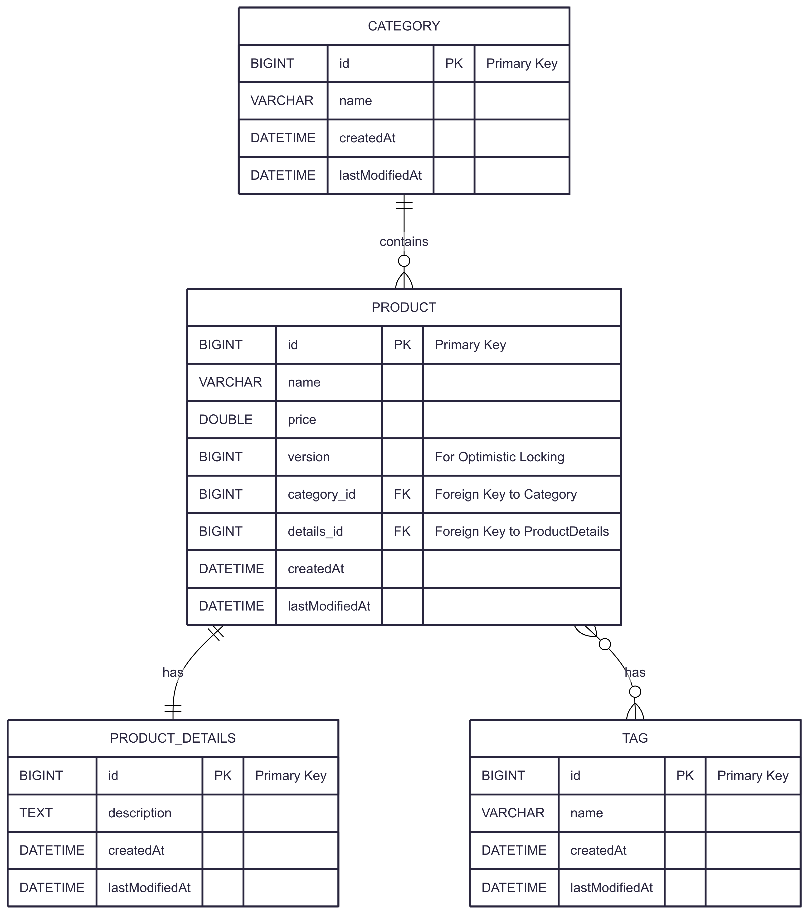

# Ứng dụng Quản lý Sản phẩm (Spring Core & JPA)

Đây là một dự án ứng dụng console được xây dựng để quản lý sản phẩm và các thực thể liên quan. Mục tiêu chính của dự án là thực hành và áp dụng sâu các kiến thức về **Spring Core** và **Spring Data JPA** trong một môi trường không sử dụng Spring Boot.

## Video Demo 🎥

[Watch the video](https://drive.google.com/file/d/1HpwylQWF9DDxvM5m9p2qYVggHuwdH5La/view?usp=sharing)

-----

## Các công nghệ sử dụng 🚀

- **Ngôn ngữ**: Java 17
- **Framework**: Spring Framework 6 (Core, Context, ORM)
- **Database Access**: Spring Data JPA 3
- **JPA Provider**: Hibernate 6
- **Database Migration**: Flyway
- **Cơ sở dữ liệu**: MySQL
- **Build Tool**: Maven
- **Utilities**: Lombok

-----

## Các tính năng và kiến thức nổi bật ✨

Dự án này vận dụng nhiều khái niệm quan trọng và nâng cao:

- **CRUD Operations**: Triển khai đầy đủ các thao tác Tạo, Đọc, Cập nhật, Xóa cho các thực thể.
- **JPA Entity Relationships**:
    - `@OneToOne` (Product ↔ ProductDetails)
    - `@ManyToOne` (Product → Category)
    - `@ManyToMany` (Product ↔ Tag)
- **Spring Core**:
    - Cấu hình hoàn toàn bằng Java (`@Configuration`).
    - Dependency Injection (Constructor Injection).
- **Quản lý Transaction**: Sử dụng `@Transactional` để đảm bảo tính toàn vẹn dữ liệu.
- **Database Migration**: Quản lý phiên bản schema của CSDL bằng các script SQL với **Flyway**.
- **JPA Nâng cao**:
    - **Optimistic Locking** với `@Version` để xử lý xung đột dữ liệu.
    - **Auditing** với `@CreatedDate`, `@LastModifiedDate` để tự động theo dõi thời gian.
    - **Custom Query Methods** trong Spring Data Repository.
    - **Fetch Strategies** (`FetchType.LAZY`) và **Cascading Operations** (`CascadeType`).

-----

## Sơ đồ quan hệ thực thể (ERD) 🗂️



-----

## Hướng dẫn Cài đặt và Chạy dự án 🛠️

### Yêu cầu

- JDK 17 hoặc cao hơn.
- Maven 3.6 hoặc cao hơn.
- MySQL Server đang chạy.

### Các bước thực hiện

1.  **Clone Repository**


2.  **Cấu hình Database**

    - Trong thư mục `src/main/resources`, đổi tên file `database.properties.example` thành **`database.properties`**.
    - Mở file `database.properties` vừa tạo và thay đổi giá trị của `jdbc.username` và `jdbc.password` cho phù hợp với cấu hình MySQL của bạn.

    <!-- end list -->

    ```properties
    jdbc.username=root
    jdbc.password=your_password
    ```

3.  **Build dự án**
    Sử dụng Maven để tải các dependency và biên dịch project.

    ```bash
    mvn clean install
    ```

4.  **Chạy ứng dụng**

    - Mở dự án trong IDE.
    - Tìm đến file `Main.java`.
    - Chạy phương thức `main()`.
    - Lần chạy đầu tiên, **Flyway** sẽ tự động thực thi các script SQL để tạo bảng và chèn dữ liệu mẫu.
    - Tương tác với các menu được hiển thị trên console.

-----

## Cấu trúc dự án 📂

- `config`: Chứa các lớp cấu hình Spring bằng Java.
- `controller`: Chứa lớp xử lý logic giao diện người dùng console.
- `model`: Chứa các lớp Entity (ánh xạ tới bảng trong CSDL).
- `repository`: Chứa các interface Spring Data JPA để truy vấn dữ liệu.
- `service`: Chứa logic nghiệp vụ chính của ứng dụng.
- `resources/db/migration`: Chứa các file script SQL của Flyway để quản lý schema CSDL.