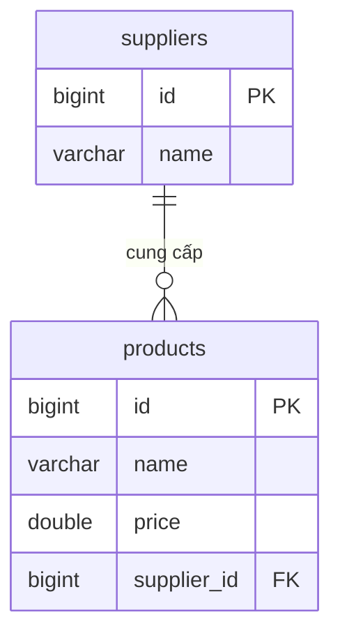

# Thực hành Spring Data JPA
## Mục tiêu:
Xây dựng project sử dụng Spring Core + Spring DataJPA demo CRUD cho các thực thể.

## Yêu cầu
- **Sử dụng Spring Core + Spring Data JPA**
- **Java Config**
- **Tối thiểu 1 model**
- **Config entity (Annotation)**
- **Dùng file properties**
- **Cấu trúc phần service sẽ chia theo loại file**: cụ thể sẽ có package service và service.impl.

## Mô hình Entity

**1.Product**
* id: long
* name: String
* price: double
* supplier_id: long
**2.Supplier**
* id: long
* name: String

## Các chức năng minh họa
- **Víết CRUD cho entity Product, Supplier**
- **Transaction**: sử dụng readonly & không sử dụng readonly.
- **Custom repository Implementations**: Tìm kiếm các sản phẩm theo id supplier và khoảng giá.
- **Sử dụng @Query**: xóa các sản phẩm của 1 nhà cung cấp theo ID.

## Hướng dẫn cài đặt
1.  **Clone repository:**
    ```bash
    git clone https://github.com/btttrangcfm09/-Naitei-Practice_SpringDataJpa.git -b buitt_practice-spring-data-jpa
    cd -Naitei-Practice_SpringDataJpa
    ```

2.  **Cấu hình database:**
    - Mở file `src/main/resources/application.properties`.
    - Tạo một database trong MySQL.
    - Cập nhật thông tin `spring.datasource.url`, `spring.datasource.username`, và `spring.datasource.password` trong database.properties. để khớp với cấu hình MySQL.
